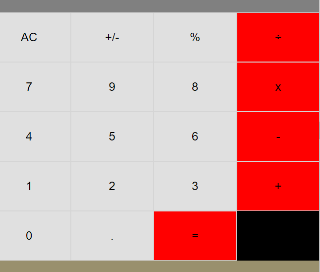

# Calculator

This app is a built using React, Javascript, Css and HTML.

# Live demo link

https://calculator-qpvp.onrender.com/

# Screenshot of the Project

,

# Highlight

You can perform the basic operations of a calculator

- Addition
- Subtraction
- Multiplication
- Division
- and more

## stacks

- [React.js](https://reactjs.org/)
- [JavaScript](https://www.javascript.com/)
- [HTML](https://html.spec.whatwg.org/)
- [CSS](https://www.w3.org/TR/CSS/#css)

# Getting Started with the project

-git clone https://github.com/folusosamuel/mycalculator
-cd into mycalculator
-npm install (unbundle dependencies)
-run npm start to view in browser

# Author

## **Foluso Makinde**

- Github: https://github.com/folusosamuel
- Linkedin: https://www.linkedin.com/in/foluso-makinde-19787158/
- Twitter: https://twitter.com/foluso_samuel

## 🙋‍♂ show your support

give a ⭐️ if you like this project!

## 📝 license

This project is [MIT](LICENSE) licensed.
